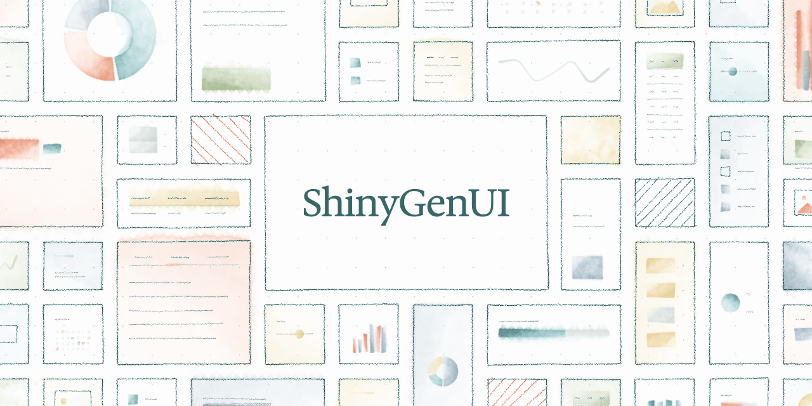
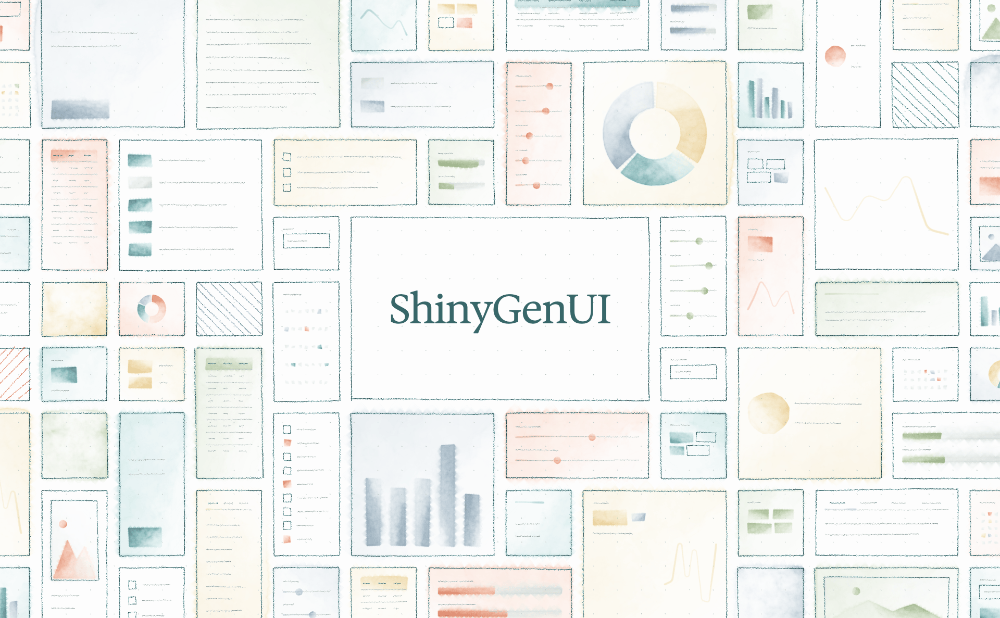

# p5.brush.skeleton

Sketched generated interfaces. A small JavaScript library on top of
[p5.js](https://p5js.org) and [p5.brush](https://github.com/acamposuribe/p5.brush)
that draws a bento grid of UI cards in pencil and fills them with watercolor
washes, hatching, charts, forms, tables, tag chips, calendars, avatars,
toggles and buttons.

## Quick start

```html
<script src="https://cdn.jsdelivr.net/npm/p5@2.3.2/lib/p5.min.js"></script>
<script src="https://cdn.jsdelivr.net/npm/p5.brush@2.2.2/dist/p5.brush.js"></script>
<script src="src/p5.brush.skeleton.js"></script>
<script>
  function setup() {
    createCanvas(1106, 1280, WEBGL);     // p5.brush needs WEBGL
    background("#f7f8f5");
    translate(-width / 2, -height / 2);  // Work in top-left coordinates

    angleMode(DEGREES);
    randomSeed(73021);                   // Reproducible output
    brush.scaleBrushes(2.2);             // Scale brushes to the canvas

    skeleton.render({ cols: 7, rows: 9 });
  }
</script>
```

The library uses p5 global mode and the global `brush` object. Call it inside
`setup()` after `translate()`. Everything is drawn in one frame; no `draw()`
loop is needed.

## Examples

[`examples/shinygenui-social-preview`](examples/shinygenui-social-preview/index.html)
is a 1280 x 640 GitHub repository social preview. Eight columns by four rows
of cards run to the edges, and the ShinyGenUI wordmark sits in a lifted 4 x 2
card in the centre, well inside the 40px safe margin GitHub recommends so it
survives cropping to other aspect ratios. Instead of sampling components at
random, it pins `kind` and `color` on each cell before `assign()` so that no
card repeats the component or color of a card it shares an edge with, every
component appears once before any repeats, and plain washes and hatches only
land on 1 x 1 cards.



Open it in a browser, or render it to PNG with headless Chrome:

```sh
tools/render.sh examples/shinygenui-social-preview/index.html social-preview.png 1280 640
```

[`examples/shinygenui-hero`](examples/shinygenui-hero/index.html) is a
1920 x 1187 blog post hero, a golden rectangle, built the same way with a
14 x 9 grid laid out over an area wider and taller than the canvas. Cards run
off all four edges, so the image reads as a window onto a larger sheet rather
than a framed grid. The wordmark panel is a golden rectangle too: `rows` is
given as an array of heights, and the three rows the panel spans are sized to
make it so. Unlike the social preview it sets `tilt`, `offset` and `jitter`
to zero and uses a faint `wiggle`: with this many cards, any misalignment
between neighbors reads as noise, and the pencil and watercolor texture carry
the hand-drawn feel on their own.



```sh
tools/render.sh examples/shinygenui-hero/index.html hero.png 1920 1187
```

## API

### `skeleton.render(options) -> cells`

Draws the dot grid, lays out the bento grid, assigns a component to every
card and draws it. Returns the cells so you can position other content over
them.

### The pipeline, step by step

`render()` is a convenience wrapper around four functions you can call
yourself when you need control in between:

```js
skeleton.dots(opts);                       // Pencil dot grid
const cells = skeleton.layout(opts);       // Bento cells, no styling yet
skeleton.assign(cells, opts);              // Kind, color, tilt, jittered corners
brush.wiggle(1.2);                         // Hand-drawn strokes
cells.forEach((c) => skeleton.drawCard(c, opts));
brush.noField();
```

Each cell is `{ x, y, w, h, col, row, spanC, spanR, reserved, kind, color,
angle, pts }`, with `x, y` at the card centre. Set `kind`, `color` or `angle`
on a cell before `assign()` to pin them. `assign()` only fills in values that
are still `null`, and applies the centre offset and corner jitter once, so call
it once per layout.

### Options

All options are optional. Defaults live in `skeleton.defaults`.

| Option | Default | Meaning |
|---|---|---|
| `width`, `height` | canvas size | Area to fill. |
| `x`, `y` | `0` | Top-left of the area. |
| `cols`, `rows` | `7`, `9` | Counts, or arrays of relative weights. `rows: [1, 1, 1.6, 1, 1]` gives a taller middle row. |
| `gutter` | `26` | Space between cards. |
| `spans` | `{ wide: 0.24, tall: 0.14, big: 0.08 }` | Chance a cell grows into a 2x1, 1x2 or 2x2 block. |
| `reserve` | `[]` | Regions to keep, in grid units: `{ col, row, spanC, spanR, kind }`. See below. |
| `kinds` | every component below except the reserved ones, wash twice | Components to sample from. Repeat a name to weight it. |
| `pick` | `null` | `(cell, opts) => kind` to choose components yourself. |
| `palette` | teal, coral, sage, sand, slate | Accent colors. The last one is used for alternate bars. |
| `ink`, `muted`, `ghost`, `dot`, `lift` | | Outline, placeholder text, ghost outline, dot grid and panel colors. |
| `tilt` | `1.8` | Max card rotation in degrees. |
| `jitter`, `offset` | `3`, `5` | Corner jitter and centre offset in canvas units. |
| `wiggle` | `1.2` | `brush.wiggle()` strength used by `render()`. `0` disables. |
| `pad` | `18` | Inner padding of card content. |
| `tintChance` | `0.55` | Chance a wireframe card gets a faint color wash. |
| `dots` | `46` | Dot grid spacing. `0` disables. |
| `brushes` | `{ outline: "2B", ghost: "2H", line: "HB", marker: "marker", dot: "2H", hatch: "HB" }` | Brush names per role. |

### Reserving space

Reserved regions become a single cell that other blocks never grow into. The
region is drawn with its `kind`, which defaults to `"ghost"`; use `"panel"`
for a lifted white card, `"blank"` for bare paper, or `null` to draw nothing.

```js
// One tall quiet row of ghost cards across the middle, one per column.
const rows = [1, 1, 1, 1, 1.6, 1, 1, 1, 1];
const reserve = Array.from({ length: 7 }, (_, col) => ({ col, row: 4 }));
skeleton.render({ cols: 7, rows, reserve });

// A 4 x 2 panel for a title, then place HTML text over it.
const cells = skeleton.render({
  cols: 10, rows: 7,
  reserve: [{ col: 3, row: 2, spanC: 4, spanR: 2, kind: "panel" }],
});
const title = cells.find((c) => c.reserved);
```

Text belongs in HTML positioned over the canvas, not in p5 `text()`: WEBGL
text needs a loaded font and never looks as crisp. The social preview example
shows the pattern.

## Components

Built in:

| Name | Draws |
|---|---|
| `wash` | Solid watercolor card. |
| `hatch` | Diagonally hatched card. |
| `text` | Title bar and body copy. |
| `avatar` | Avatar circle with two lines of text. |
| `button` | Two lines of text and a primary button. |
| `bars` | Bar chart. |
| `line` | Sparkline. |
| `toggle` | Rows of toggle switches with labels. |
| `kpi` | Caption, big number block, change chip, footnote, and a trend line when wide or tall. |
| `input` | Form: labelled input fields and a submit button. |
| `tabs` | Tab bar with one active tab, then body copy. |
| `progress` | Labelled progress bars. |
| `list` | Checklist with checked and unchecked boxes. |
| `chips` | Rows of tag chips under a caption. |
| `slider` | Labelled range sliders. |
| `pie` | Donut chart in three colors, with a legend when wide. |
| `image` | Image placeholder: framed area with a sun and hills, caption when tall. |
| `table` | Data table with a tinted header row. |
| `calendar` | Month label over a grid of days, some marked. |

Plus `ghost`, `panel` and `blank` for reserved regions.

A component is a function `(cell, opts, helpers)` that draws inside
`cell.pts`, the jittered corner polygon of the card. Add or replace one with
`skeleton.register(name, fn)`, then list the name in `kinds` or return it from
`pick`.

```js
// A rating: five dots, the first few filled in, then a review.
skeleton.register("rating", (cell, opts, helpers) => {
  const { color, pts } = cell;
  const { left, top, cw, ch } = helpers.inner(cell, opts);
  helpers.outline(pts, opts, 0.95, helpers.maybeTint(cell, opts));
  const filled = 2 + Math.floor(random(4));
  for (let i = 0; i < 5; i++) {
    const dot = helpers.circlePoints(left + 10 + i * 22, top + 12, 8, 16);
    helpers.wash(dot, i < filled ? color : opts.ghost, 170, 0.05, 0.3, false);
  }
  helpers.lines(left + cw / 2, top + 20 + (ch - 20) / 2, cw, ch - 24, opts, 2);
});

skeleton.render({ kinds: ["wash", "rating", "rating", "bars"] });
```

`skeleton.helpers` provides:

| Helper | Draws |
|---|---|
| `rectPoints(x, y, w, h, angle, jitter)` | Rotated, jittered rectangle corners. |
| `circlePoints(cx, cy, r, n, wobble)` | Slightly irregular circle polygon. |
| `arcPoints(cx, cy, r, a0, a1, n)` | Points along an arc, angles in radians. Concatenate two for a ring sector. |
| `inner(cell, opts)` | The card's content box after padding: `{ left, top, cw, ch }`. |
| `wash(pts, color, opacity, bleed, texture, scatter)` | Watercolor fill. |
| `outline(pts, opts, weight, tint)` | Pencil outline, optionally over a faint tint. |
| `frame(x, y, w, h, angle, opts, color, weight)` | Thin pencil rectangle: inputs, image frames, checkboxes. |
| `lines(x, y, w, h, opts, n, color)` | Placeholder text lines. |
| `pill(x, y, w, h, angle, color, opacity)` | Solid small block: buttons, toggles, bars. |
| `maybeTint(cell, opts)` | The card color or `null`, per `tintChance`. |
| `others(cell, opts)` | Palette colors other than the card's own. |
| `deg(a)` | Converts degrees to the current p5 `angleMode()` for `brush.hatch()`. |

Every helper leaves stroke, fill and hatch disabled, so components can be
composed without state leaking between them.

## Rendering to PNG

`tools/render.sh` screenshots a page with headless Chrome at a given size,
fails if WebGL did not initialize, and compresses the capture in place with
`pngquant` when it is installed:

```sh
tools/render.sh <input.html> <output.png> <width> <height>
```

Chrome needs network access for the CDN scripts and for the Google font the
examples use.

## License

MIT
